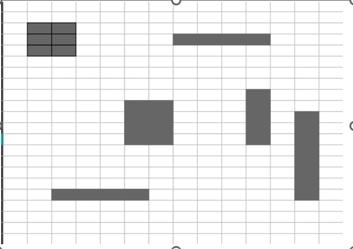

Alumno:  
Luis Gerardo Sanchez Santoyo  
Numero de control: 19121077  
Carrera: ISC
-------------

Ensayo sobre el libro "Inteligencia artificial un enfoque moderno"
=============

### Introducción

La inteligencia artificial tiene un crecimiento muy grande desde sus comienzos y con ella tambien crecen las preguntas, miedos y genera mucha incertidumbre y muchas opiniones diferentes sobre lo que es la inteligencia artificial. En este ensayo se hablará sobre los capitulos 1, 2, 26 y 27 del libro "Inteligencia artificial un enfoque moderno" en los cuales se explica que es la IA, su historia, los agentes y su estructra, enfoques filosoficos y el futuro de la inteligencia artificial.

### Capitulo 1

### ¿Qué es la Inteligencia Artificial y cómo se aborda?

El libro "Inteligencia Artificial: un enfoque moderno" presenta cuatro definiciones de inteligencia artificial, la primera “Sistemas que piensan como humanos” que tienen como ejemplos las siguientes definiciones: «El nuevo y excitante esfuerzo de hacer que los computadores piensen... máquinas con mentes, en el más amplio sentido literal». (Haugeland, 1985), «[La automatización de] actividades que vinculamos con procesos de pensamiento humano, actividades como la toma de decisiones, resolución de problemas, aprendizaje...» (Bellman, 1978). La segunda “Sistemas que piensan racionalmente” que tiene como ejemplo las siguientes oraciones: «El estudio de las facultades mentales mediante el uso de modelos computacionales». (Char-niak y McDermott, 1985) «El estudio de los cálculos que hacen posible percibir, razonar y actuar». (Winston, 1992). La tercera “Sistemas que actúan como humanos” que tienen de ejemplo las siguientes oraciones: «El arte de desarrollar máquinas con capacidad para realizar funciones que cuando son realizadas por personas requieren de inteligencia». (Kurzweil, 1990), «El estudio de cómo lograr que los computadores realicen tareas que, por el momento, los humanos hacen mejor». (Rich y Knight, 1991), y por último “Sistemas que actúan racionalmente” que tienen de ejemplo las siguientes oraciones: «La Inteligencia Computacional es el estudio del diseño de agentes inteligentes». (Pooleetal., 1998)«IA... está relacionada con conductas inteligentes en artefactos». (Nilsson, 1998).  

La IA busca replicar la capacidad humana de razonar, aprender, resolver problemas y tomar decisiones. Para mi punto de vista la IA busca solo acercarse a la forma en que un humano haría las cosas, pero solo enfocado a una sola área y nunca igual que el humano, puede ser incluso que mejor pero únicamente para esa área. Aunque es posible hacer varios sistemas interconectados para abarcar más áreas y destacar en esas se necesitarían de muchísimo más procesamiento de cómputo y es ese el porque no es igual a la “Inteligencia del ser humano”.  

### La prueba de Turing

El libro menciona una prueba famosa que se utiliza para agentes de la IA, se llama prueba de Turing propuesta por Alan Turing en 1950 esta prueba se realizó para poder proporcionar una definición operacional y satisfactoria de inteligencia, Consiste en realizar preguntas o realizar la actividad que se desea someter a la prueba donde un evaluador deberá saber diferenciar entre si es maquina o si es un humano, si el evaluador no logra percibir si las respuestas recibidas de la maquina son de un humano o de la maquina propia la maquina supera la prueba.

En el libro se hablan de distintos conceptos como es el teorema de incompletitud la cual dice que hay afirmaciones matemáticas que son ciertas, pero no pueden demostrarse como verdaderas o falsas dentro del sistema en el que se formulan.  

En este libro se adopta el criterio de que la inteligencia tiene que ver principalmente con las acciones racionales. Desde un punto de vista ideal, un agente inteligente aquel que emprende la mejor acción posible ante una situación dada. Se estudiará el problema de la construcción de agentes que sean inteligentes en este sentido.  

En resumen, el capítulo uno de el libro nos da una introducción a lo que es la inteligencia artificial, su historia, algunos conceptos científicos y también filosóficos, el cómo nació la inteligencia artificial y como fue evolucionando con el paso de los años. Con esto en mente puedo decir que con el avance tecnológico que llevamos al paso de unos pocos años la inteligencia artificial podrá superar a la inteligencia de un humano en su totalidad ya que el poder de cómputo será suficiente para poder soportar todas las exigencias que un sistema completo de inteligencia artificial.

### Capítulo 2: agentes inteligentes

En este capítulo se mostrará como el concepto de racionalidad se puede aplicar a una amplia variedad de agentes que operan en cualquier medio imaginable compatible. En el libro utilizan este concepto para desarrollar un conjunto de principios de diseño que sirvan para construir agentes útiles, sistemas que puedan ser llamados razonablemente inteligentes. Es decir, los autores exploran como el concepto de racionalidad se puede aplicar a una amplia variedad de agentes (maquinas o sistemas) que operan en diversos entornos. La idea central es que los agentes deben tomar decisiones y actuar de manera inteligente y lógica para alcanzar sus objetivos de manera efectiva. La racionabilidad puede ayudar a desarrollar maquinas o sistemas que sean considerados inteligentes y efectivos en la toma de decisiones.  

### Agentes y su entorno  

El libro define al agente como cualquier cosa capaz de percibir su medioambiente con la ayuda de sensores y actuar mediante actuadores. Para que un agente pueda interactuar y razonar de manera inteligente debe de tener un entorno con el cual interactuar. El libro nos presenta dos conceptos muy importantes el cual es la percepción que indica que el agente puede recibir entradas en cualquier instante y la secuencia de percepciones, esta refleja el historial completo de lo que el agente ha recibido. Todos estos conceptos conllevan un agente, pero esto no significa que el agente sea racional, el libro pone un ejemplo de una aspiradora la cual va recogiendo suciedad en donde la aspiradora percibe en que cuadrante esta y si hay suciedad en el y puede elegir si limpiar, moverse a la izquierda o derecha o decidir si no hace nada. Pero esto no significa que el agente sea racional o inteligente ya que puede solo estar limpiando infinitamente porque la suciedad puede que la este moviendo solo de un lado a otra, o también puede que tarde semanas limpiando un pequeño cuarto.  

### Buen comportamiento: el concepto de racionalidad

En este apartado el libro nos presenta el concepto de agente racional, es decir aquel agente en el cual hace lo correcto y de la manera mas optima para poder obtener el mejor resultado posible y para poder lograr esto el libro nos presenta unas las medidas de rendimiento que nos sirven para poder medir de alguna manera el éxito.  

Las medidas de rendimiento incluyen criterios que determinan el éxito en el comportamiento del agente, cuando un agente genera una secuencia de acciones hace que su ambiente pase por una secuencia de estados. Si la secuencia es la deseada entonces el agente habrá actuado de manera correcta. Únicamente determinando bien la medida de rendimiento de cada agente se podrá llegar a la secuencia de estados correcta. Si retomamos el ejemplo de la aspiradora que propone el libro, se puede proponer como medida de rendimiento que termine de limpiar una zona tan solo en un par de horas, esto únicamente se podría alcanzar con agentes racionales. El libro dice “Como regla general, es mejor diseñar medidas de utilidad de acuerdo con lo que se quiere para el entorno, más que de acuerdo con cómo se cree que el agente debe comportarse.” Relaciono mucho esta frase con algunas practicas dentro de mi carrera universitaria ya que la mayoría de mis profesores piden algo específicamente tal cual lo quieren ellos sin importar que las medidas de rendimiento no sean las adecuadas, es decir lo puedes hacer de manera diferente mas enfocado al entorno en el que se desarrolla y usarlo específicamente para mejorar ese agente. También se presenta muchas veces en las malas prácticas de programación con la frase “No sé cómo funciona peor funciona” sabiendo que en ese punto puedes no estar teniendo buenas medidas de rendimiento.

### Capítulo 26: Fundamentos filosóficos

En este capítulo se examina lo que significa pensar y si las maquinas deberían de hacerlo o no.  
En el libro se habla sobre dos hipótesis, la primera habla sobre la IA débil que habla sobre la afirmación de que es posible que la maquinas actúen con inteligencia y por otro lado tenemos el libro nos presenta la hipótesis de IA fuerte la cual consiste en la afirmación de que las maquinas si piensan realmente y no solo simulan una inteligencia. La realidad esta mas acercada con la IA débil ya que las maquinas están hechas para hacer trabajos específicos y solo siguen instrucciones que si se hacen en una secuencia correcta parece que la maquina piensa con verdadera inteligencia.  

### IA débil: ¿Pueden las maquinas actuar con inteligencia?

El libro replantea la pregunta ¿Pueden pensar las maquinas? Y pone de ejemplo dos preguntas muy interesantes, la primera ¿Pueden volar las maquinas? A la cual responde que en efecto las maquinas pueden volar, ya que existen diferentes maquinas como los aviones, drones, helicópteros etc. que pueden volar, pero lo mas interesante es la siguiente pregunta: ¿Pueden nadar las maquinas? Y lo primero que se nos viene a la mente es que, si porque existen los barcos o submarinos, pero justo después de este planteamiento nos da la definición de nadar: “La palabra nadar («swim» en inglés) ha llegado a tener el significado de “moverse por el agua mediante el movimiento de las partes del cuerpo»” lo cual me puso a pensar y en efecto las maquinas se pueden mover por el agua, pero eso no significa que puedan nadar.  

### La objeción matemática

En el libro se habla sobre un teorema, el teorema de incompletitud de Gödel, el cual nos dice lo siguiente:  

- G(F) es una sentencia de F, pero no se puede probar dentro de F.  
- Si F es consistente, entonces G(F) es verdadero.  

Y como ejemplo nos pone lo siguiente: “ninguna persona podría calcular la suma de 10 billones de números de 10 dígitos en su vida, en cambio un computador podría hacerlo en segundos”. Lo cual da para pensar que existen un montón de cosas que las maquinas pueden hacer que las personas no les seria posibles, pero esto no quiere decir que las maquinas son superiores ya que también existen muchas otras cosas las cuales las personas pueden hacer mil veces mejor que una maquina como por ejemplo la habilidad de pensar.  

### La ética y los riesgos de desarrollar la Inteligencia Artificial

Esta parte del libro habla sobre los peligros de la IA y nos hace preguntarnos si deberíamos seguir con el desarrollo de la inteligencia artificial ya que no supone múltiples amenazas de las cuales el libro habla de 6 en específico. La primera de ellas ya la estamos viviendo y para algunos no le supone una amenaza sino oportunidades y es la de “Las personas podrían perder su trabajo por la automatización”. Otra a la que deberíamos poner mucho ojo es: “La utilización de los sistemas de IA podría llevar a la pérdida de responsabilidad.” Ya que puede que la IA se utilice para tomar decisiones criticas de vida o muerte, otra amenaza que supone una alta amenaza es: “El éxito de la IA podría significar el fin de la raza humana” actualmente nos hemos dado cuenta de que conforme avanza la tecnología la ciencia y ficción de las películas se vuelve cada vez más una realidad acertada así que esta amenaza de la IA nos pone a preguntarnos si de verdad deberíamos de seguir avanzando en el desarrollo de la IA.

### Capítulo 27: "IA: presente y futuro”

Uno de los desafíos mas grandes que tuvo la IA fue el que las maquinas pudieran interactuar con su entorno, los humanos necesitaban dar entradas a las maquinas para interpretar las salidas. Pero ahora con el avance tecnológico que hay este ya no supone un problema, es decir la interacción con el mundo físico ya no es un punto débil en la IA, y se han superado muchas barreras tecnológicas.

Un aspecto crucial para un agente inteligente es la capacidad de seguir el estado del mundo. Esto implica tanto la percepción como la actualización de las representaciones internas. Los avances en la lógica proposicional y de primer orden, junto con los algoritmos de filtrado para entornos inciertos, han permitido un mejor seguimiento del mundo. Sin embargo, la percepción real, que a menudo es imperfecta, sigue siendo un desafío. La combinación de probabilidad y lógica de primer orden se presenta como una solución prometedora para rastrear entornos complejos y enfrentar la incertidumbre de identidad, donde no se conoce la identidad de los objetos observados.

En el apartado 27.3 se habla sobre si estamos llevando una dirección adecuada en el desarrollo de la inteligencia artificial, la respuesta corta a esta interrogante es “No, pero por ahora estamos bien”. Pero para abordar mas a fondo esta cuestión se toman varias perspectivas como lo es la búsqueda de la racionalidad perfecta que se presenta como un ideal pero que es inalcanzable en entornos complejos y la "racionalidad calculadora" sugiere que los agentes deberían actuar de manera óptima desde el principio de su deliberación, pero esta aproximación no siempre es práctica, ya que la respuesta adecuada puede carecer de valor en el momento oportuno.

Por otro lado, tenemos la racionalidad limitada la cual reconoce la limitación de la mente humana para abordar problemas complejos y promueve la satisfacción, es decir, encontrar una respuesta "suficientemente buena". Y por ultimo la "optimalidad limitada" emerge como una alternativa prometedora, donde los agentes se esfuerzan por actuar lo mejor que pueden dadas sus limitaciones computacionales. Esto ofrece una base sólida para la IA, ya que es práctica y adaptable a entornos reales.

El camino de la IA parece que sigue la optimalidad limitada ya que tiene un enfoque mas realista y ofrece una base sólida para la creación de agentes inteligentes que se adapten a cualquier entorno que se presente.

### ¿Qué ocurriría si la IA tuviera éxito?

La IA como cualquier tecnología avanza a pasos agigantados y a medida que avanza se abren oportunidades y desafíos nuevos y cada vez mas complejos. La IA ya a podido demostrar su superioridad en muchas áreas desde la automatización de procesos, operaciones realmente complejas hasta la asistencia de toma de decisiones difíciles para un ser humano.

Los éxitos de la IA de nivel medio tendrán un impacto en la sociedad en general, alterando la forma en que trabajamos y vivimos. Los asistentes personales y las aplicaciones de oficina más efectivos pueden mejorar nuestras vidas, pero también pueden llevar a la automatización de empleos, lo que plantea desafíos económicos y laborales.

Hasta la fecha no se regula el desarrollo de la IA esto quiere decir que se puede utilizar de manera que quieras incluso de manera ilícita. Por dar un ejemplo se pueden crear armas automatizadas con la inteligencia artificial. Es por eso que la IA puede convertirse en una amenaza si los desarrolladores de esta misma no regulan los aspectos éticos y legales que conlleva la IA.

En resumen, el impacto de la IA dependerá de cómo se utilice y como se regule. Toda la responsabilidad de que la IA tenga un impacto positivo en la sociedad depende de sus investigadores y desarrolladores como dijo Turing “Todavía queda mucho por hacer” y todo eso debemos de tomarlo con sabiduría y responsabilidad.

-----------------------------------------------

# Ensayo sobre el video Discovery Latinoamérica | Inteligencia Artificial – IBM

en este ensayo se ven distintos aspectos, como los éticos donde se llevan cuestiones sobre si deberíamos de desarrollar la IA, los temores sobre maquinas más inteligentes que un ser humano, también se llevan acabo temas de las ventajas de la IA en el sector salud, la accesibilidad o la competitividad en distintos ámbitos. Uno de los mas interesantes puntos es como aborda los temas de investigación, ya que lo que para un humano seria imposible para una maquina con inteligencia artificial sería posible e incluso fácil. También se lleva a cabo el miedo a la privacidad de las personas, lo que lleva me lleva a pensar, en la actualidad ¿Tenemos privacidad? Otro tema interesante del video Discovery Latinoamérica | Inteligencia Artificial – IBM es la fusión con máquinas, el cual habla sobre lo que en un pasado no muy lejano pudiéramos llamar ciencia ficción y que ahora podemos ver como una realidad no muy lejana. Para mí la evolución de la inteligencia artificial es una realidad y avanzara igual que la tecnología es decir exponencialmente, para cuando nos demos cuenta la inteligencia artificial generará nuevos empleos y en cuanto se tenga una explosión de IA esta misma estará presente en todos lados y será tan necesaria como lo es ahora las conexiones a internet o los dispositivos móviles.

### Comprensión del lenguaje

Uno de los Temas mas complicados dentro de la inteligencia artificial es la comprensión del lenguaje natural, hacer que hablen es lo menos complicado, pero hacer que lo entiendan es lo más difícil ya que ciertas palabras pueden tener muchos diferentes significados y las maquinas solo siguen reglas previamente escritas que si tratamos de escribir un código con esta regla caería en muchas redundancias.

Que sea difícil de realizar no significa que sea imposible. Dentro del video Discovery Latinoamérica | Inteligencia Artificial – IBM se da un ejemplo de una IA que se entrenó con muchísimos datos llamado Watson que es capaz de comprender las complejidades del lenguaje natural, tanto como para competir contra los mejores jugadores de jopardi. Este ha sido uno de los grandes avances que ha tenido la IA enfocada al entendimiento del lenguaje natural. Watson intenta comprender la pregunta y la divide para buscarla en una gran cantidad de documentos e información para después compararla y llegar a una posible respuesta, todo esto en tan solo cuestión de segundos. Este avance con Watson y Jopardi solo ha sido una demostración del poder que tiene la IA y la tecnología en la investigación y en cómo se podría utilizar en los problemas más difíciles del mundo.

A su vez algunos investigadores de la IA crean un sistema capaz de debatir en tiempo real, este sistema al igual que Watson lo entrenan con muchísimos datos, documentos, gramática y también lo han entrenado en debates reales para poder aprender de sus contrincantes. En cuestión de segundos la IA busca, consulta, conecta e investiga sobre el tema a debatir, te da una respuesta e incluso ya esta preparando un argumento para refutar o incluso poner un poco de humor al debate y lo mejor de todo sin trabarse al hablar, sin ponerse nervioso, sin muletillas y sin restricciones. Esto en mi opinión llega a ser incluso aburrido de escuchar, no me imagino un debate donde una maquina ya lo sabe todo, es cierto que puede servir para muchas otras cosas como algún tutor, algún maestro que te pueda enseñar, orientador o simplemente para investigar y hacer verle al mundo las cosas como son. Pienso que la maquina que debate tiene mucho potencial en otras áreas y puede ayudar a los seres humanos en investigaciones que si no se hiciera con inteligencia artificial o con ayuda computacional seria completamente imposible para nosotros.

### Inteligencia artificial en el camino

El video Discovery Latinoamérica | Inteligencia Artificial – IBM habla sobre la inteligencia artificial en las calles, es decir como los autos autónomos que actualmente ya existen en sus versiones muy básicas, por ejemplo, se muestra un auto de pizza de Ford, donde el auto se maneja solo hasta tu puerta y tu únicamente recoges tu comida del auto. También se muestra un proyecto de la empresa uber el cual buscaba la autonomía de un auto para poder transportar a las personas. Prácticamente estamos hablando de enseñarle a una maquina a manejarse por si sola casi como enseñarle a un bebe a caminar. Lo primero que se debe considerar es el caos que existe en una ciudad y lo impredecible que puede llegar a ser manejar un auto, para un humano hay ciertas condiciones las cuales puede limitarnos a manejar de manera correcta y segura, como el clima y la obscuridad de la noche, los cuales para un sistema automatizado no existe problema alguno, pero hay otros a considerar como por ejemplo el que exista un grupo de niños jugando a una pelota, esto quiere decir que la pelota puede llegar hasta la calle y un niño iría tras de ella y ocasionar un accidente, también el que pasaría si la maquina encargada de operar el vehículo presenta fallos, esto podría causar algún tipo de accidente y podría llegar a ser fatal. En mi opinión aun es muy temprano para poder desarrollar al 100% un auto autónomo ya que para minimizar cualquier fallo se necesitaría de una estandarización en las calles para que funcione un auto sea donde se encuentre, la IA en el camino es una realidad muy cercana que espero poder disfrutar algún día ya que ayudaría a mejorar tanto lo ambiental, lo económico y lo social en ciudades enteras.

### ¿Como aprenden las maquinas?

En el video Discovery Latinoamérica | Inteligencia Artificial – IBM se menciona una oración muy interesante “Se quiere que las maquinas piensen como los humanos” esta cuestión es muy alejada de la realidad ya que actualmente las maquinas solo son programadas para un objetivo en especifico y no tienen un individualismo ni la capacidad de aprender muchas cosas en diferentes contextos. Sin embargo, las maquinas si pueden aprender por si solas incluso ya se hacia desde hace un par de décadas con una máquina que se enseñó así mismo a jugar damas chinas que incluso jugó mejor que el creador de la misma máquina, el sistema analiza millones de datos en los cuales dependiendo las posiciones de las piezas puede generar los mejores movimientos para poder ganar el juego. En el aprendizaje automático una maquina busca patrones, analiza datos y usa esos patrones para encontrar la mejor ruta para alcanzar el objetivo.

Existe un juego chino llamado GO que tiene mas posiciones de fichas que átomos en el universo, una inteligencia artificial llamada AlphaGo aprendió a jugar este juego por si sola sin siquiera poner juegos de ejemplo simplemente jugando consigo misma, mientras que el aprendizaje automático generalmente implica aprender de millones de datos, AlphaGo aprendió de sus pruebas y errores y en el proceso genero sus propios datos para aprender. Es muy interesante saber que una maquina actualmente puede aprender por si sola. Este es un tema el cual pienso debe regularse ya que puede salirse de las manos, aunque no actualmente, pero en un futuro, las maquinas podrían aprender a como vulnerar sistemas, aunque también veo las ventajas que podrían ser el avanzar exponencialmente en medicinas para encontrar curas a enfermedades que hoy en día y que podría lograrse ya que las IA pueden abarcar muchas mas opciones y considerar millones de variables mas que una mente humana o que muchas mentes humanas juntas.

### Trabajando con la IA

Desde hace ya tiempo las industrias y el empleo han evolucionado muchísimas veces y con ello viene la eliminación de empleos y la creación de nuevos de ellos. En el video el video Discovery Latinoamérica | Inteligencia Artificial – IBM nos dice que la llegada del internet y la era digital a la vida cotidiana elimino varios trabajos que actualmente ya no existen como, por ejemplo: creador de mapas, mecanógrafo, agente de viajes y operador telefónico, también se revoluciono la industria de la música y la forma en que esta se escuchaba. Pero no todo es malo la llegada de estos conceptos creo distintos empleos nuevos, como administradores de redes sociales, venta por internet, desarrollador de aplicaciones, etc.

Actualmente es esencial la automatización de los procesos en las fábricas y tiendas, ya que optimizan el tiempo en que se puede por ejemplo fabricar un objeto o atender un cliente. Esto se hace gracias a la existencia de robots que se encargan de “las tareas difíciles”. Los robots en las empresas son un hecho y en un futuro con la IA se podrán optimizar aún más los procesos y ayudar aun mejor en las fábricas, puedo asegurar que puede que ya no sea necesario el factor humano en algo relacionado con esto.

Claro que esto desplazaría a los humanos a quedarse sin empleos, pero yo lo veo de una manera distinta ya que podrán crearse nuevos empleos como, por ejemplo, los robots necesitaran si o si una supervisión humana para los detalles que no estén dentro del alcance de estos mismos, ocuparan mantenimiento como cualquier maquina y además se ocupara quien enseñe a trabajar y el como se hacen las cosas a los robots, o por lo menos solo la primera vez.

Una empresa llamada rethink robotics creo un brazo robótico el cual se encarga de tareas tanto de precisión como tareas que pueden llevar mucho tiempo y pueden llegar a ser muy tediosas para algún humano que llega a cansarse con el pasar del tiempo. Estos robots son inteligentemente artificiales ya que una persona le entrena para saber que cosa y como hacerlo tan solo un par de veces después lo hará por sí solo e incluso reconocer algún error que pueda suceder dentro del proceso, es decir se capacita al robot tal cual como si fuera un humano.

No cabe duda de que los empleos están en constante evolución y mas aun cuando se trata de tecnología, no dudo que en un futuro los empleos que existen hoy en día dejen de hacerlo y se creen nuevos, que incluso puedan llevar menos esfuerzo físico, solo espero que esto no nos lleve a una crisis de desempleo y que podamos dirigir bien hacia donde puede llevarnos la robótica y la IA.

### Aprendizaje de por vida

La inteligencia artificial ayuda desde muy jóvenes a aprender en distintos ámbitos como la lectura, las matemáticas, historia, investigación, etc. En el video Discovery Latinoamérica | Inteligencia Artificial – IBM nos muestran que es posible con inteligencia artificial ampliar el vocabulario de los niños con distintas palabras y además individualizando el aprendizaje ya que como es bien sabido no todas las personas aprenden al mismo ritmo ni tampoco de la misma manera.

Dentro del video nos presentan una aplicación la aplicación Sesame esta aplicación trata de enseñarle palabras al niño que la usa la aplicación se ajustan al vocabulario de cada niño, la IA recopila datos de las palabras para evaluar el nivel del vocabulario del niño y con los datos decide si puede llevar un vocabulario más avanzado o si debe seguir alimentando al niño con palabras de un mismo nivel, así, con esto, aprenden un vocabulario más amplio desde muy pequeños que repercute a su vida adulta.

También nos presentan un proyecto “Watson Education:tutor” es una IA que ayuda a el estudio de los universitarios. (Literal un tutor privado) Watson tiene acceso a miles de datos que te puede ayudar a estudiar, te hace preguntas y si respondes correctamente es que va funcionando de una manera correcta sino Watson hará otra pregunta más específica y te guiará correctamente para que aprendas el tema objetivo. Si no sabes la respuesta a la pregunta que te realiza Watson puedes pedir que te de pistas o que te guie. Watson adapta todo el conocimiento para cada estudiante en específico ya que no todas las personas aprenden de la misma manera.

### fusión con las maquinas

Nos fascina la idea de fusionarnos con las maquinas como en las películas de ficción por ejemplo Iron Man, donde es increíble como con ayuda de la tecnología los humanos pueden mejorar sus habilidades y  su biología. Actualmente en la realidad lo hemos aprovechado muy poco y es muy temprana las tecnologías que se han desarrollado para poder mejorar a los humanos.

¿Se pueden mejorar el humano con las maquinas? La respuesta a esta pregunta en mi opinión es que en efecto si se pueden mejorar a los humanos con las maquinas y esto combinado con IA sería una combinación perfecta para crear lo que solamente se puede ver en la televisión y en las películas

### Ver y escuchar el mundo a través de la IA

En el video Discovery Latinoamérica | Inteligencia Artificial – IBM muestran a una persona con problemas visuales donde esta persona quería adaptarse a su ceguera mediante el ejercicio en especial correr, quería estar en un maratón evidentemente es algo muy difícil por su discapacidad visual. Con ayuda de Lear Works crearon unas pulseras para poder ayudar a esta persona a correr. Mediante vibraciones guía al usuario, si te sales del camino vibra de un lado o de otro, así podrás mantenerte en el camino. Esta tecnología crea un corredor virtual al trazar una ruta GPS y aprendizaje automático y con la retroalimentación aptica aseguras que estas dentro del corredor virtual. Si no recibes vibraciones apticas quiere decir que estas en un buen camino.

### Un sexto sentido sintético

Con la llegada del almacenamiento de los datos y la necesidad de proteger nuestros datos, cuentas, etc. en internet también se crea un concepto de privacidad de los datos, ya que cuando ingresas tu nombre, dirección o cualquier tipo de dato personal en internet este se guarda en algún lado en la gran nube que es internet y no sabes en manos de quien esta toda esta información que estas poniendo a disposición. Algunas personas piensan que con la IA y el reconocimiento facial o cualquier tipo de biofirmas la privacidad se perderá, lo que no se dan cuenta aun es que esa privacidad ya no existe por que todos tus datos actualmente ya están digitalizados en internet, quizá solo estén guardados en alguna base de datos, pueden estar entrenando una inteligencia artificial con ellos o peor aún están comercializando con tus datos personales. Yo digo que puedo sacrificar esa “privacidad” (Si es que aún queda algo de ella) por la seguridad que ofrecen las tecnologías como el reconocimiento facial.

Al día de hoy podemos ver que en nuestro día a día nos encontramos muchísimos diferentes dispositivos, todos con cámaras y con micrófonos y muchas personas nos hacen dudar de que estos podrían estar encendidos escuchándonos o viéndonos y guardando nuestros datos en alguna base de datos para su análisis y entrenamiento de distintas plataformas. A quien no le ha pasado que estas hablando sobre realizar la compra de algo y de repente te salen anuncios de eso que estabas hablando. Bueno cada vez mas deja de ser una creencia que las maquinas nos pueden ver y oír y se vuelve una realidad que volviendo a lo que decía la privacidad de nuestros datos en la era digital no existe en absoluto.

Anteriormente mencione las ventajas que puede traer un reconocimiento facial y es que pueden ser muchísimas que incluso puede servir como firma digital, así como la huella dactilar solo que mucho mas rápido, podemos usarlo para detectar si una persona es potencialmente delincuente o si esta persona es en verdad quien dice ser en sus documentos físicos y si me voy muchos años en el futuro podría decir que se podrían predecir los crímenes que alguna persona pudiera cometer.

### En busca de un descubrimiento

Regresando al tema de investigación se menciona mucho a Watson y la IA ya que puede ayudar al sector salud para poder ver las conexiones entre millones de artículos libros etc, para poder descubrir tratamientos nuevos con medicinas ya existentes, darles un nuevo enfoque a las medicinas existentes, cosa que sería humanamente imposible ya que es muchísima información por procesar el cual con la ayuda de IA y Watson es posible en cuestión de incluso segundos. La inteligencia artificial puede ayudar a los investigadores a encontrar curas a padecimientos que no los tienen como por ejemplo el cáncer, el Alzheimer, el sida, etc. todos estos padecimientos pueden incluso ya estar resueltos en la infinidad de libros que existen de medicina solo que hace falta analizar todos y cada uno de ellos que como bien dije esto sería humanamente imposible pero con ayuda de una inteligencia artificial muy bien entrenada como la que es Watson ayudaría a acelerar esta investigación y recortar el tiempo en el que pueda llegarse a descubrir una cura a esas enfermedades que al día de hoy las consideramos incurables.

### Inteligencia General artificial

Aunque la inteligencia artificial está en estos momentos muy limitada ya que no puede hacer muchas cosas en contextos diferentes no me cabe la menor duda de que en un futuro, que espero poder ver, la inteligencia artificial si pueda hacer lo que sea en el contexto que se encuentre. A esa acción de realizar diferentes cosas en diferentes contextos se le llama inteligencia general que es la que actualmente tenemos los humanos.

La inteligencia artificial de las maquinas solo puede hacer una cosa a la cual fueron programadas, por mas que pongas a un robot, al cual solo este hecho para caminar, a jugar futbol o algún deporte pues este fallará en todos los intentos que lo pongas ya que jamás lo programaste para que hiciera eso y no está en su código el jugar con una pelota y llevarla hasta la portería para anotar un gol.
Da un poco de miedo pensar en si algún día la inteligencia artificial será tan potente capaz de replicar a un ser humano. Pero creo que es un objetivo de la inteligencia artificial y los investigadores de esta misma alcanzar la singularidad de la IA.
Pero no se le debe de tener miedo a un ente más inteligente que tu al contrario yo pienso que esta singularidad nos puede ayudar a mejorar en muchos aspectos, quizá podríamos aprender de una IA con individualismo y con una singularidad. Aunque la opinión publica se ve que esta mas pegada a que nadie en la tierra puede ser mas inteligente que un humano ya que se sentirían amenazados.

La IA es una elección que nosotros mismos estamos haciendo y será nuestra decisión el como llevemos en un futuro esta herramienta, desde la actualidad debemos moldear la IA al modo que mas nos convenga a los humanos.

--------

# La Teoría de las Inteligencias Múltiples

La teoría de las inteligencias múltiples según Gardner.
Durante el tiempo se han realizado diversas investigaciones sobre la inteligencia artificial y se han analizado distintos factores como lo son la parte ética y moral, la parte económica, sus inicios e incluso lo que depara en un futuro para la inteligencia artificial.


Hubo un hombre llamado Howard Gardner el cual es un profesor en la universidad de Harvard, psicólogo e investigador y el propuso que la inteligencia no es solo 1 sola inteligencia sino 8 tipos de inteligencia que trabajan casi independientes una de las otras, pero también trabajan en equipo. A todo esto, lo denomino como la teoría de las inteligencias múltiples.

Primero que nada, recordemos cual es la definición de inteligencia. Esta se define como la capacidad o facultad de entender, razonar, saber, aprender y de resolver problemas mediante lo aprendido. Es decir, la inteligencia no es saber mucho sino es saber que hacer con lo que ya se sabe.

Ya que se tienen en claro estas definiciones pasemos al primer tipo de inteligencia.

### La inteligencia Lingüística

Esta inteligencia es la capacidad de una persona para expresarse y expresar una idea. Es prácticamente el poder comunicarse. Por ejemplo, si tú te comunicas con otras personas y logras entender lo que te están diciendo eso es la inteligencia lingüística. Algunas de sus características son:

- Capacidad de entender información hablada y escrita
- Habilidades para la comunicación
- Facilidad e interés por los idiomas
- Inclinación por la lectura

Esta inteligencia se puede mejorar adoptando algunas rutinas y ejercicios como por ejemplo leer libros, leer poesía, escribir ensayos como estos e incluso algunos juegos como scrabble, the legend of zelda.

### Inteligencia lógico-matemática

Quizá sea la inteligencia mas conocida ya que es la mas popular entre las inteligencias, muchos sistemas como lo es el educativo le toman mas importancia a esta inteligencia que a todas las demás. Esta inteligencia esta relacionada con la capacidad de solucionar problemas relacionados con los números siguiendo algunas reglas de lógica. Las características principales de esta inteligencia pueden ser las siguientes:

- Encontrar solución de tipo lógica a los problemas
- Habilidad para el cálculo mental y monetario
- Interés por los puzles y desafíos mentales
- Memoria de diferentes signos numéricos

Y como cualquier otra inteligencia claro que si se puede mejorar por ejemplo resolviendo rompecabezas realizar cálculos mentales. Es por eso que a la mayoría de los que estudiamos ingeniería es más notorio el interés por estimular este tipo de inteligencia.  

### Inteligencia visual y espacial

Esta inteligencia que obtenemos a través de la vista, esta habilidad nos permite observar el mundo y los objetos desde diferentes perspectivas. Las personas como los pintores, escultores y diseñadores tienen muy bien desarrollada la inteligencia visual y espacial. Otro ejemplo de una persona con buena inteligencia visual es un conductor de taxi que cuando les das una dirección al cual ir ellos en su mente crean un mapa y todas las rutas alternas para poder llegar a ese destino.

Es muy interesante ya que también lleva el concepto de espacial ya que esto quiere decir que involucra la resolución de problemas en nuestra mente. El nivel de esta inteligencia puede medir la capacidad o el éxito que tendremos al realizar algunas tareas como el manejar un auto, construir algo, orientarse en un mapa o ciudad o incluso darle instrucciones a alguien más.

Algunas de las características de la inteligencia visual y espacial son las siguientes:

- Alto sentido de la orientación
- Habilidad para manipular el color, líneas, figuras y o espacios.
- Interés por las disciplinas del arte
- Memoria espacial
- Rotación y manipulación mental de los objetos

Para poder mejorar esta inteligencia no puede ser muy fácil e incluso me atrevo a decir que es de las más difíciles de estimular de las 8 inteligencias. Para poder estimular la inteligencia visual y espacial puedes manejar tu auto con precaución ya que esto te puede ayudar a dimensionar en este caso el auto propio, jugar con plastilina este puede ayudar a mejorar la motricidad y a visualizar objetos, también rotar objetos mentalmente y rompecabezas siempre y cuando sean 3D.

### La inteligencia musical

Esta inteligencia es la que por lo menos en los sistemas educativos de México siempre pasa desapercibido. Gardner afirma que la inteligencia musical de una persona es parte de su inteligencia. Algunas partes del cerebro ejecutan funciones vinculadas con la interpretación y composición de la música, esto quiere decir que la música estimula al cerebro, lo nutre y se necesita para poder tener salud mental. En esta inteligencia se incluyen términos como la sensibilidad al ritmo, el tono y también el timbre. Las personas que estamos en contacto casi del diario con la música podemos afirmar que cuando se empieza en la música esa sensibilidad se vuelven tan notorias que incluso te preguntas como es que antes no lo notabas. Algunas características de esta inteligencia pueden ser:

- Habilidad para reconocer algunos patrones rítmicos
- Facilidad en el aprendizaje de canciones
- La imitación en el canto, melodía y ritmos
- Talento para reconocer canciones con tan solo escuchar algunas notas

Para estimular esta inteligencia es muy fácil ya que la música la encuentras en todos lados, lo que puedes hacer es, bailar, aprender a tocas un instrumento, cantar, escuchar música y también componer música.

### Inteligencia corporal o cinestésica

Esta inteligencia es la responsable de las habilidades corporales y motrices, dentro de esta inteligencia podemos incluir: la fuerza, la coordinación, el equilibrio, la velocidad, la flexibilidad, también la habilidad de utilizar herramientas. Porque crees que eres mas bueno en los deportes que otras personas, o quizá con esta inteligencia sabrás el porque tu amiga siempre recortaba las cosas bien derechitas y tu jamás pudiste cortarlo perfecto. Algunas de las características de la inteligencia corporal o cinestésica son las siguientes:

- Destrezas de tipo físico
- Sentido del ritmo y coordinación
- Atracción por el deporte, danza y manualidades
- Seguridad
- Precisión
- Agilidad en los movimientos

Esta inteligencia va de la mano con nuestro cuerpo, si nuestro cuerpo es débil nuestra inteligencia corporal también lo será así que se tiene que mantener un cuerpo fuerte y saludable. Para mejorar la inteligencia corporal pueden ser las siguientes:

- Practicar deportes
- Practicar con plastilina
- Teatro

### Inteligencia Naturalista

Esta inteligencia se define como la capacidad para percibir el medio ambiente y manipular los elementos que los componen, esta inteligencia es considerada como la mas importante en el humano a nivel evolutivo ya que determino la supervivencia en el entorno natural y la capacidad y adaptarse en el ambiente que se encontraba. Algunos de los rasgos más importantes de la inteligencia naturalista son los siguientes:

- Necesidad de estar en contacto con la naturaleza
- Curiosidad por los animales
- Curiosidad por el mundo
- Interés por las plantas
- Empatía por otros seres vivos

En pocas palabras si a ti te gusta estar encerrado en tu cuarto o en tu casa te hace falta mucha inteligencia naturalista y para poder estimular esta inteligencia se pueden hacer distintas actividades como caminar en los bosques, acampar, tener plantas, ver las nubes, tener una mascota, etc.

### Inteligencia interpersonal e intrapersonal

La inteligencia interpersonal evalúa la capacidad para empatizar y relacionarse con otras personas. Y la inteligencia intrapersonal es la capacidad o el grado de conocimiento propio es decir la inteligencia intrapersonal se dirige a nosotros mismos y que tan capaces somos de reconocer nuestras intenciones, motivaciones, deseos, estados de ánimo, etc. Estas dos inteligencias suelen ser difíciles de estimular, pero son muy necesarias para nuestro desarrollo en la sociedad. Para poder mejorar nuestras relaciones con otras personas podemos practicar la escucha activa sin juzgar, estar abiertos a lo que nos quieran decir y la empatía y para mejorar la relación con nosotros mismos se puede practicar la meditación y explorar nuestras debilidades y fortalezas.

En conclusión, un ser que se considere inteligente debe tener al menos estas 8 inteligencias trabajando en conjunto, eso en esencia es la inteligencia humana, algo que una maquina no podría tener o al menos no por ahora. Yo pienso que el día que una maquina logre tener estas 8 inteligencias será el momento mas alto en la historia de la IA y habrá una revolución en la tecnología y la sociedad como la conocemos. Ahora la pregunta que me queda es ¿Es correcto hacer una maquina que tenga estas 8 inteligencias?.

---------------------------------

## Problema de los 8 alfiles

Coloca ocho alfiles (cuatro negros y cuatro blancos) en un tablero deajedrez reducido, tal como se ve en la figura. El problema consiste en hacer que los alfiles negros intercambien sus posiciones con los blancos, ningún alfildebe atacar en ningún momento otro del color opuesto. Se deben alternar los movimientos, primero uno blanco, luego uno negro, luego uno blanco y así sucesivamente.
Para explicar la solución de este problema vamos a numerar cada casilla como se muestra a continuación:

|1|2|3|4|
|:----|:----|:----|:----|
|5|6|7|8|
|9|10|11|12|
|13|14|15|16|
|17|18|19|20|

La posición inicial de los alfiles negros es 1,2,3,4 mientras que los alfiles blancos se encuentran en las casillas 17,18,19,20, teniendo dos alfiles que se moverán en las casillas blancas y dos que se moverán en las negras por cada color de las piezas, el tablero inicial se ve de esta manera donde N es para las piezas negras y b para las piezas blancas:

|N|N|N|N|
|:----|:----|:----|:----|
|5|6|7|8|
|9|10|11|12|
|13|14|15|16|
|B|B|B|B|

El juego comienza con las piezas blancas, y el primer movimiento es realizado por el alfil en la casilla 18, moviéndose a la casilla 15. Después, las piezas negras realizan su primer movimiento con el alfil de la casilla 3, desplazándose a la casilla 6. Considerando estos movimientos, el tablero quedará de la siguiente manera.

|N|N|3|N|
|:----|:----|:----|:----|
|5|N|7|8|
|9|10|11|12|
|13|14|B|16|
|B|18|B|B|

En el segundo turno el alfil blanco que se encuentra en la casilla 17 se mueve a la casilla número 8, dando por finalizado el turno. El alfil negro que se encuentra en la casilla 4, se mueve a la casilla número 13 dejando el tablero de la siguiente manera.

|N|N|3|4|
|:----|:----|:----|:----|
|5|N|7|B|
|9|10|11|12|
|N|14|B|16|
|17|18|B|B|

Hasta el momento los dos colores están actuando en forma espejo, es decir que hacen los mismos movimientos, pero del lado contrario, el alfil blanco que se encuentra en la casilla 19, se mueve a la casilla 14. El alfil negro que se encuentra en la casilla 2, se mueve a la casilla 7 dejando el tablero de la siguiente manera.

|N|2|3|4|
|:----|:----|:----|:----|
|5|N|N|B|
|9|10|11|12|
|N|B|B|16|
|17|18|19|B|

El alfil que se encuentra en la posición 15 se moverá a la casilla número 5 y acabará el turno de los blancos. El alfil negro que se encuentra en la casilla 6 se moverá a la casilla numero 16 y quedará el tablero de la siguiente manera.

|N|2|3|4|
|:----|:----|:----|:----|
|B|6|N|B|
|9|10|11|12|
|N|B|15|N|
|17|18|19|B|

En este momento los dos jugadores ya pueden guardar un alfil, empezando por el blanco que se encuentra en la casilla 8, se moverá a la casilla 3. El alfil negro que está en la casilla 13, se guardara en la casilla 18.

|N|2|B|4|
|:----|:----|:----|:----|
|B|6|N|8|
|9|10|11|12|
|13|B|15|N|
|17|N|19|B|

En el turno del blanco se moverá el alfil que está en la casilla número 14 hacia la casilla número 9. El turno del negro se moverá el alfil de la casilla 7 se moverá a la casilla 12 y el tablero queda de la siguiente manera.

|N|2|B|4|
|:----|:----|:----|:----|
|B|6|7|8|
|B|10|11|N|
|13|14|15|N|
|17|N|19|B|

En este turno el blanco moverá el alfil de la casilla 5 hacia la casilla 10. El jugador de las piezas negras moverá el alfil de la casilla 16 hacia la casilla 11 y el tablero quedará de la siguiente manera.

|N|2|B|4|
|:----|:----|:----|:----|
|5|6|7|8|
|B|B|N|N|
|13|14|15|16|
|17|N|19|B|

Ahora regresaremos el alfil de la casilla 9, a la casilla 19. También se regresará el alfil de la casilla 12, hacia la casilla numero dos 2 y el tablero estara de la siguiente manera.

|N|N|B|4|
|:----|:----|:----|:----|
|5|6|7|8|
|9|B|N|12|
|13|14|15|16|
|17|N|B|B|

En este momento los dos colores pueden guardar su segundo alfil, el blanco moverá su alfil de la casilla 10, a la casilla número 4. Por su parte el negro moverá su alfil de la casilla 11, para guardarlo en la casilla 17.

|N|N|B|B|
|:----|:----|:----|:----|
|5|6|7|8|
|9|10|11|12|
|13|14|15|16|
|N|N|B|B|

Hasta el momento el comportamiento de los turnos ha sido como en espejo, ambos tienen el mismo número de alfiles guardados, el blanco moverá su alfil de la casilla 20, hacia la casilla 10. El negro moverá el alfil de la casilla 1 a la casilla 11.

|1|N|B|B|
|:----|:----|:----|:----|
|5|6|7|8|
|9|B|N|12|
|13|14|15|16|
|N|N|B|20|

Ahora guardamos los alfiles de las esquinas para permitir más movimientos sin riesgo de que se capturen entre sí. El alfil blanco de la casilla 3 se moverá a la casilla 9, mientras que el alfil negro de la casilla 18 se moverá a la casilla 12. El tablero quedará de la siguiente manera.

|1|N|3|B|
|:----|:----|:----|:----|
|5|6|7|8|
|B|B|N|N|
|13|14|15|16|
|N|18|B|20|

El blanco moverá su alfil de la casilla 10 hacia la casilla 13, de manera de espejo el negro moverá su alfil 11 a la casilla 8.

|1|N|3|B|
|:----|:----|:----|:----|
|5|6|7|N|
|B|10|11|N|
|B|14|15|16|
|N|18|B|20|

Sacaremos de nuevo los alfiles que están en las casillas 19 y 2 respectivamente. El blanco que se encuentra en la casilla 19 se moverá a la casilla 16 y el negro que se encuentra en la casilla 2 se moverá a la casilla 5.

|1|2|3|B|
|:----|:----|:----|:----|
|N|6|7|N|
|B|10|11|N|
|B|14|15|B|
|N|18|19|20|

Ahora vamos a guardar los alfiles en su lado contrario, guardaremos el alfil blanco que se encuentra en la posición 16 lo guardamos en la posición 1. Mientras tanto el alfil negro que se encuentra en la posición 5, lo guardaremos en la posición 20 lo cual el tablero quedará de lasiguiente manera.

|B|2|3|B|
|:----|:----|:----|:----|
|5|6|7|N|
|B|10|11|N|
|B|14|15|16|
|N|18|19|N|

En este punto, dos alfiles están en su lugar y otros dos están fuera. En el próximo turno, el alfil blanco de la casilla 9 se moverá a la casilla 6, mientras que el alfil negro de la casilla 12 se moverá a la casilla 15. Esto resultará en el siguiente estado del tablero.

|B|2|3|B|
|:----|:----|:----|:----|
|5|B|7|N|
|9|10|11|12|
|B|14|N|16|
|N|18|19|N|

Ahora moveremos el alfil blanco que se encuentra en la casilla 13 a la casilla 7 y el alfil negro de la casilla 8 a la casilla 14, para alinearlos y en los próximos turnos ya poder guardarlo. El tablero quedará de la siguiente manera.

|B|2|3|B|
|:----|:----|:----|:----|
|5|B|B|8|
|9|10|11|12|
|13|N|N|16|
|N|18|19|N|

Ahora vemos que estamos a dos turnos de lograr cambiar todos los alfiles, el siguiente movimiento será guardar un alfil de cada color, empezaremos con el blanco de la casilla 6 se moverá a la casilla 3 y el alfil negro de la casilla 15, lo guardaremos en la casilla 18 y el tablero queda de la siguiente manera.

|B|2|B|B|
|:----|:----|:----|:----|
|5|6|B|8|
|9|10|11|12|
|13|N|15|16|
|N|N|19|N|

Como último paso, simplemente colocamos el último alfil blanco de la casilla 7 en la casilla 2 y el último alfil negro de la casilla 14 en la casilla 19. Este movimiento sigue el patrón establecido durante todo el juego. Con esto, hemos completado el juego, logrando el objetivo de intercambiar los alfiles sin que ninguno se atacara, con un total de 36 movimientos.

|B|B|B|B|
|:----|:----|:----|:----|
|5|6|7|8|
|9|10|11|12|
|13|14|15|16|
|N|N|N|N|

En resumen, el objetivo se logra en un mínimo de 18 turnos con 36 movimientos en total. Todos los movimientos siguieron un patrón espejo en el tablero, evitando que los alfiles se atacaran. Este tipo de problemas desarrolla habilidades como el pensamiento lógico, la paciencia y el pensamiento crítico, esenciales tanto para las personas como para las inteligencias artificiales.

---------------------------------

# Busqueda de islas

Se trata de trata de un problema de recursividad, donde tenemos un tablero de X * Y numero de casillas en donde si encontramos un elemento debemos contarlo como una isla. Una isla puede ser un conjunto de casillas en vertical o en horizontal o incluso una sola casilla puede ser considerada una isla. Un ejemplo de cómo se verían las islas esta en la siguiente imagen.



Esto es únicamente un ejemplo del como serian las islas ya que estas pueden aparecer en cualquier parte del tablero e incluso el tablero puede ser del tamaño que sea.

El primer problema con el que nos enfrentaríamos sería el cómo identificar una isla del resto del tablero. Esto se soluciona simplemente poniendo una etiqueta diferente al del tablero. Por ejemplo, en una matriz podríamos meter puros “0” y a una isla el numero “1” para poder diferenciar una isla del tablero.

Un segundo problema que se puede ver es como saber si la isla es vertical u horizontal o incluso una cruz, en general la forma de la isla. Para detectar el espacio más cercano y al frente es decir el siguiente en la fila simplemente le sumariamos un 1 a la matriz y lo compararíamos con la etiqueta que corresponda, pero ¿qué pasa si la isla va en vertical?

Un tercer problema que se puede identificar es el como saber que una isla ya fue visitada y no volver a contarla y caer en un ciclo. Bueno ese problema es sencillo simplemente se cambia la etiqueta que tiene por una diferente a la del tablero y a la de la isla por ejemplo un “-1”.

Para la solución que plantee veremos la programación en Python directamente.

Primero se crea el tablero con las dimensiones que más te gusten para una visualización más clara de tablero.

``` python
import random
tam_filas = 4
tam_columnas = 6
arreglo = [[0] * tam_columnas for _ in range(tam_filas)]
```

En este caso solo se creó un tablero de 4*6 en un arreglo para simular las casillas del tablero. Todas las casillas o mejor dicho todo el arreglo se llena con el numero “0” para “poner vacío el tablero”

Lo siguiente por hacer es llenar el tablero con islas, el cual hice una función donde llena aleatoriamente el arreglo o el tablero con los números “0” y “1” de manera aleatoria para seguido de ello imprimir el arreglo para saber cómo quedarían las islas.

```python
def llenar():
    for x in range(tam_filas):
        for y in range(tam_columnas):
            arreglo[x][y] = random.randint(0, 1)
            print(f"  {arreglo[x][y]}  ", end="")
        print()
```

Después de ello hice la función contar_islas donde prácticamente se encuentra la solución a los problemas que este ejercicio plantea.

Primero se crea un contador inicializado en 0 para ir contando las islas en cada iteración. Seguido de esto se crea un ciclo for anidado con otro ciclo for para iterar cada uno de los espacios y dentro de este ciclo anidado viene la primera condición y es si en el camino de recorrer el arreglo se topa con la etiqueta de la isla es decir el numero “1”, si la condición se cumple entonces se va a la función buscar_vecinos para precisamente encontrar toda la isla completa. Se aumenta el contador de la isla cuando finalice y se regresa de la función la variable que estuvo contando las islas en cada iteración.

``` python
def contar_islas():
    islas = 0

    for x in range(tam_filas):
        for y in range(tam_columnas):
            if arreglo[x][y] == 1:
                buscar_vecinos(x, y)
                islas += 1

    return islas
```

La siguiente función se encarga de buscar todas las casillas por las cuales esta conformada la isla y esto lo hace a manera recursiva, en este caso para manejar la recursividad tenemos una condición o el estado base que es la condición para saber si ya no hay mas elementos dentro de la isla o si se sale del arreglo, o si ya se conto el elemento. En cualquiera de esos casos la función acaba ahí y se regresa ya sea a la misma función o a contar la siguiente isla. Eso es la primera condición que se puede observar en el código.

La función recibe 2 parámetros que es la posición en la que se encuentra el iterador en donde en la primera vuelta es 0,0. Primero se verifica el caso base donde este es si x o y son menores a 0 es decir si ya fueron visitados o si la casilla donde se posiciona se sale del arreglo o si este es 0 o diferente de 1.

Si cualquiera de esos casos no se cumple entonces quiere decir que la isla continúa haciéndose más grande y que no se ha terminado de cambiar todos los elementos de la isla por “-1” .

Entonces con los parámetros que se pasaron a la función, que marcan la posición de la casilla, se marca como visitada es decir con el valor de “-1”. Y se continúa buscando en la isla si tiene mas elementos. Por ejemplo, en la primera vuelta se posiciona en la primera casilla es decir 0,0 y en esa casilla hay un numero 1, entonces se cambia ese valor por -1, después de eso se le resta uno a la fila es decir los parámetros que se usan para llamar a la misma función de manera recursiva serian -1,0 como este valor entra en el caso base se regresa a la función donde los valores son 0,0 y sigue el curso de la función. Ahora se manda llamar asimismo la función pero con los valores 1,0  e igualmente lo hace con las columnas. Solo le suma o le resta a el segundo parámetro de la función para buscar.

```python
def buscar_vecinos(x, y):
    if x < 0 or y < 0 or x >= tam_filas or y >= tam_columnas or arreglo[x][y] != 1:
        return

    arreglo[x][y] = -1

    buscar_vecinos(x - 1, y) #Busca en las filas hacia atrás
    buscar_vecinos(x + 1, y) #Busca en las filas hacia adelante
    buscar_vecinos(x, y - 1) #Busca en las columnas hacia arriba
    buscar_vecinos(x, y + 1) #Busca en las columnas hacia abajo
```

y así con esta función recursiva no importa el tamaño, la forma de la isla o el tamaño del tablero siempre podrá contar las islas en el tablero. Una vez terminado de recorrer toda la isla y cambiar las etiquetas “1” por “-1” se regresa a la función contar_islas a sumar una isla al contador y seguir recorriendo el arreglo hasta encontrar otro numero 1 y repetir de nuevo todo el proceso recursivo ya que este “1” marcaria otra isla.

Y por último solo quedaría mandar llamar la función llenar para llenar de islas al tablero e imprimir la variable islas para saber cuántas islas conto la variable iterador durante el proceso.

```python
llenar()
    print("Numero de islas en la matriz:", contar_islas())
```

-------------------------

# Detección de objetos rojos en una imagen

Partiendo de una imagen a color con distintos objetos de distintos colores debemos de identificar y contar los que son de un color en específico, en este caso es el color rojo. Para empezar este problema primero debemos de ver el como una computadora puede mostrar colores y para ello hablaré de 2 formas en especifico que son el RGB y el HSV.

Vamos a explorar las diferencias entre los modelos de color RGB (Red, Green, Blue) y HSV (Hue, Saturation, Value) y cómo funcionan cada uno.

### Modelo de Color RGB

1. Componentes:
    - Rojo (Red): Controla la intensidad del color rojo.
    - Verde (Green): Controla la intensidad del color verde.
    - Azul (Blue): Controla la intensidad del color azul.
2. Funcionamiento:
    - Cada componente varía en intensidad de 0 a 255.
    - La combinación de estos tres colores en diferentes intensidades crea una amplia gama de colores.
    - Por ejemplo, si los tres componentes están en su valor máximo (255, 255, 255), se obtiene blanco, mientras que si están en su valor mínimo (0, 0, 0), se obtiene negro.
3. Aplicaciones:
    - Ampliamente utilizado en la visualización de colores en pantallas de dispositivos como monitores, televisores y cámaras digitales.
    - En el diseño gráfico y la programación visual.

### Modelo de Color HSV

1. Componentes:
    - Matiz (Hue): Representa el tipo de color en grados (0-360).
    - Saturación (Saturation): Mide la intensidad del color (0-100%).
    - Valor (Value): Mide la luminosidad del color (0-100%).
2. Funcionamiento:
    - Matiz define el tipo de color en la rueda de colores.
    - Saturation controla la pureza del color, con 0% siendo un tono de gris.
    - Value representa la luminosidad, donde 0% es negro y 100% es blanco.
    - Este modelo es más intuitivo para la selección y manipulación de colores.
3. Aplicaciones:
    - Ampliamente utilizado en el diseño gráfico y la edición de imágenes.
    - Facilita el ajuste intuitivo de colores al permitir cambios independientes en matiz, saturación y valor.

### Diferencias Clave

1. Representación:
    - RGB se basa en la mezcla aditiva de luces para formar colores.
    - HSV se enfoca en la percepción humana del color, facilitando la manipulación intuitiva.
2. Selección de Colores:
    - RGB es más técnico y menos intuitivo para la selección de colores.
    - HSV proporciona una rueda de colores más natural para el ojo humano.
3. Manipulación de Imágenes:
    - HSV es más comúnmente utilizado en aplicaciones de edición de imágenes debido a su naturaleza intuitiva.

Ahora que entendemos un poco mejor estos dos tipos de representación de los colores vemos claramente que es más fácil manipular los colores cuando utilizamos el HSV ya que podemos seleccionar más fácilmente algún color o colores en específico. Así que para darle una solución al problema de detectar los objetos rojos en una imagen utilizaremos esta gama de colores en HSV.

A continuación, explicaré la solución que propuse para este problema.

Primero que nada, se debe de leer la imagen la cual contendrá los objetos de color rojo y además de importar la librería de CV lo cual se hace de la manera siguiente.

```py
import cv2 as cv 
img = cv.imread("images/f1.jpg")
```

Después de esto asignamos el rango de colores en HSV para el color rojo, para esto se marca un color alto y un color bajo que es la gama de colores rojo que se tomarán en cuenta para los objetos, entre más ajustada estén estos altos y bajos mejor será la detección del color, en este caso el sistema HSV tiene dos espectros de color rojo por lo cual en las siguientes líneas de código tenemos 2 valores para alto y 2 valores para bajos.

```py
redBajo1 = (0,100,20)
redAlto1 = (4,255,255)

redBajo2 = (174,100,20)
redAlto2 = (179,255,255)
```

seguido de esto debemos de cambiar el espectro de BGR a HSV de la imagen para poder trabajar con los colores correspondientes. Y esto se hace con una función de CV tal cual se muestra a continuación

```py
img1 = cv.cvtColor (img, cv.COLOR_BGR2HSV)
```

Una vez que tenemos la imagen en colores HSV debemos de crear unas mascaras que servirán para que únicamente se muestren los objetos que tienen los valores de rojo que declaramos anteriormente que son los de redBajo y redAlto. Se crean ambas mascaras para filtrar los objetos de color rojo y como son 2 diferentes se crean 2 por separado para después combinarlas con la función de cv.add() justo como se muestra a continuación. Una vez aplicadas estas mascaras estas quedaran en una escala de blanco y negro es decir estarán binarizadas.

```python
mask1 = cv.inRange (img1, redBajo1, redAlto1)
mask2 = cv.inRange (img1, redBajo2, redAlto2)
mask = cv.add(mask1, mask2)
```

seguido de esto limpio con operadores morfológicos para disminuir el ruido de los objetos detectados y también falsos positivos o pixeles de rojo que son diminutos.

```py
kernel = cv.getStructuringElement(cv.MORPH_ELLIPSE, (3, 3))
limpio = cv.morphologyEx(mask, cv.MORPH_OPEN, kernel)
```

Hasta este punto en la imagen limpio podemos ver ya todos los objetos de color rojo aislados y simplemente quedaría contarlos. Para ello debemos de detectar los contornos que se generaron de cada uno de los objetos, para ello creamos una tupla para todos los contornos que hemos aislado con las máscaras anteriormente mencionadas. Se inicializa un contador en 0 para ir contando los objetos de la imagen y se crea un ciclo para recorrer todas las figuras que se detectaron para poder tener más información sobre ellas.

```py
ctns, _ = cv.findContours(limpio, cv.RETR_EXTERNAL,cv.CHAIN_APPROX_SIMPLE)
cont = 0
for c in ctns:
```

Dentro del ciclo se crea una variable que toma en cuenta el área del objeto que se detecto para saber el tamaño de este y hacer una condición para que solo tome en cuenta los objetos de cierto número de pixeles y evitar los que probablemente sean un falso positivo. Si el objeto es lo suficientemente grande se crea un rectángulo de color negro sobre la imagen original para poder detectar con facilidad el objeto que es de color rojo y por último se aumenta el contador de objetos.

```py
for c in ctns:    area = cv.contourArea(c)
    if (area > 15):
        x,y,w,h = cv.boundingRect(c)
        cv.rectangle(img,(x,y),(x+w,y+h), (0,0,0),2)
        cont = cont + 1
```

por ultimo se crea un texto sobre la imagen con la función de cv.putText() pasándole el contador de objetos, la posición que deseamos que se muestre el resultado del contador de objetos y también el color, fuente y tamaño de la letra para posteriormente mostrar las capas utilizadas y la imagen original con los objetos encerrados en un cuadrado negro y el contador de objetos arriba a la izquierda de color rojo.

```py
cont = str(cont) + " objetos rojos"
cv.putText(img, str(cont), (20,30), cv.FONT_HERSHEY_SIMPLEX, 1, (0,0,255), 2)
cv.imshow ('limpio', limpio)
cv.imshow ('mask', mask)
cv.imshow ('original', img)
cv.waitKey ()
cv.destroyAllWindows ().
```

----

# El problema de Josephus

La historia que sigue es una versión adaptada de lo que –supuestamente— sucedió durante el siglo I. Sí, el siglo uno. Suena raro, ¿no? Más aún: esa 5 historia dio origen a un problema clásico de la matemática/computación que sobrevivió el paso del tiempo. Se lo conoce con el nombre del “Problema de Josephus”, ya que se supone que fue Flavius Josephus, un historiador judío nacido en Jerusalén, quien describió la situación que vivieron él y 40 soldados que lo acompañaban.

En un momento determinado de la guerra judeo-romana, Josephus y su grupo cayeron en una emboscada y quedaron atrapados en una caverna rodeada de soldados enemigos. Después de debatir cómo proceder, optaron por suicidarse antes de ser capturados. Sin embargo, Josephus no estuvo de acuerdo con la propuesta y para que nadie tuviera que quitarse la vida, propuso el siguiente método:

“Sentémonos todos en un círculo. Alguno de nosotros empezará primero y matará a quien tenga sentado a la izquierda y así vamos a seguir hasta que –claramente— quedará nada más que uno solo de nosotros con vida. Ese será el único que tendrá que suicidarse”.

Allí están las cuarenta y un posiciones numeradas en forma creciente. Supongamos que empieza el que está sentado en la posición número 1. Ese soldado matará al 2. Luego, el 3 matará al 4, el 5 al 6. . . y así siguiendo. Como usted advierte, llegará un momento en el que habrán muerto todos los que están sentados en las posiciones que llevan un número par. Pero cuando muera el último de ellos, el número 40 (a manos del 39), el 41 estará vivo aún y ahora, el que tiene sentado a la izquierda es el número 1 quien había empezado con los asesinatos.

De acuerdo con las reglas, el 41 matará al 1, el 3 matará al 5, etc. Creo que ahora está claro que van a morir todos hasta que quede solamente uno con vida.

Es aquí donde aparece una parte interesante de la historia de Josephus. En principio, habrían de morir todos los soldados que estaban con Josephus en la caverna, pero la diferencia es que quien quedara último tendría que suicidarse. . . Más aún: el sobreviviente tendría que quitarse la vida y no habría ningún otro integrante del grupo que estuviera vivo para verificar que lo hiciera.

Como usted se imagina, Josephus eligió un lugar particular del círculo y se sentó allí. El sabía que siguiendo las reglas escritas más arriba, él habría de quedar como único sobreviviente. Esperó que todos estuvieran muertos, y en lugar de suicidarse, salió de la caverna y se entregó al enemigo.

Pregunta: ¿en qué lugar se sentó Josephus?

El problema es muy conocido en el mundo de la matemática y los programadores, y es por eso que hay muchísima literatura escrita sobre el tema, pero no hace falta saber nada particular para poder pensarlo. La versión que figura más arriba es solo una de las posibles variantes (la más sencilla) y si yo estuviera junto a usted, le sugeriría que no empiece con el caso de los 41 soldados, sino que intente con números más pequeños (de soldados) de manera tal de ver si le es posible intuir o imaginar una estrategia para determinar al ganador o sobreviviente a medida que va incrementando el número de soldados.

De la misma forma, una vez que hayamos resuelto el problema para 41 soldados, sería interesante pensar en una estrategia que permita deducir cuál será la posición ganadora en el caso general, es decir, independizarse del número 41 y encontrar alguna estrategia o fórmula que permita deducir el número que hay que elegir sin tener que recorrer todos los pasos intermedios.

Para resolver este tipo de problemas algo que solemos hacer mucho es hacer unos cuantos casos a mano y tratar de encontrar una regularidad vamos a llamar S(n) al superviviente en un círculo de n personas o soldados.

Vamos con algunos ejemplos. Si n es 1 pues S(1) es 1. Si n es 2 el 1 mata al 2 y sobrevive el 1 asi que S(2) = 1. Si n es 3 entonces el uno mata al 2 y el 3 mata al 1 así que S(3) = 3. Siguiendo este ejemplo podemos llenar una tabla como la siguiente.

|n|1|2|3|4|5|6|7|8|9|10|11|12|13|14|15|16|17|
|:----|:----|:----|:----|:----|:----|:----|:----|:----|:----|:----|:----|:----|:----|:----|:----|:----|:----|
|S(n)|1|1|3|1|3|5|7|1|3|5|7|9|11|13|15|1|3|

Analizando un poco esta tablita nos podemos dar cuenta ya varias cosas. Primero que todos los S(n) son números impares así que con esta conclusión podemos decir que ponerse en un numero par no es una muy buena idea.

Además podemos ver que existe cada ciertos tiempos un 1. Este numero 1 aparece en cuando n vale 1, 2, 4, 8, 16, esto quiere decir que aparece cuando n es potencia de 2. A continuación comprobaremos lo de los pares y lo de las potencias de dos para comprobar que no es solo una casualidad.

Primero lo mas sencillo, ¿los números pares siempre mueren?. Pues si por lógica todos los pares mueren en la primer ronda ya que el uno mata al 2 el 3 al 4 el 5 al 6 y así hasta terminar la ronda, así que los pares mueren todos en la primera ronda.

Lo de las potencias de 2 es un poco mas complicado pero demos un ejemplo. Si tenemos que el número n de personas en el círculo es par ocurre siempre que en la primera ronda los pares mueren y le toca actuar de nuevo al número uno, pero ahora tenemos la mitad de personas en el círculo o sea n/2 que si vuelve a ser par estaremos en la misma situación inicial pero con la mitad de soldados y se volverá a cumplir que en el circulo quedará un numero que es potencia de 2 hasta que queda solamente una persona, que es la persona que inicio todo. Esto comprueba que S(n)=1 si n es una potencia de 2.

Ahora para el caso general podemos decir que todo número se puede poner como una Potencia de dos más otro numero. Por ejemplo el 18 = 2^4 + 2. Bueno pues para resolver una parte hacemos lo siguiente: supongamos que el numero de soldados es 2^a+m. Vamos a hacer solo “a” turnos los primeros “A” impares matan a su compañero y entonces le toca el turno al número 2m+1 entonces ya encontramos al superviviente y será el de esta formula.

En el caso de Flavio josephus que eran 41 personas resulta que 41 es 2 elevado a 5 + 9 o sea que M es 9 con lo que la posición del superviviente es la 19.

Por ultimo realice este programa que puede detectar la posición que sobrevivirá tomando en cuenta las condiciones anteriormente explicadas, La primer condición es por si se igresa un 0 en el numero de soldados, este regresa un False ya que pues este problema necesita tener mas de 1 soldado, la segunda condición es por si el numero es par y que el numero de soldados sea exactamente una potencia de 2 si se cumple entonces la posición que se salvará será la numero 1.

Si no se cumplen estas condiciones quiere decir que estamos en el caso general es decir la formula 2m+1 y se hacen las operaciones necesarias para poder realizar la formula y finalmente se retorna el valor de la posición que se salvará.

```py
#La formula que da solucion a cualquier numero de soldados es 2m + 1
import math
def josephus(n):
    if n <= 0:
        return False
    n1=n
    n1 = math.log2(n)
    if n%2 == 0 and n1.is_integer():
        return 1
    else:
        potencia = math.floor(math.log2(n))
        #print(potencia)
        m = n - 2**potencia
        posicion_vive = 2*m+1 ##Formula para cualquier numero impar
        return posicion_vive
num_soldados = 41
posicion = josephus(num_soldados)
print("La posicion que vive es: ", posicion)
```

----

# Introducción a la Inteligencia Artificial: El papel de la heurística

Los laberintos de forma cuadrada o rectangular son los más antiguos que existen; la primera representación conocida de un laberinto de este tipo se encuentra en una tablilla de Pilo y también aparece, como sello, en las tumbas del antiguo Egipto, donde se hizo famoso desde la antigüedad el Laberinto de Fayum, citado por Heródoto. Los laberintos de forma redonda o circular aparecieron a fines del siglo VII a. C. en la Italia etrusca; más tarde, aparecen en las monedas de Cnosos, a finales del siglo III a. C. y se cree que eran usadas como mapa del célebre Laberinto de Creta.

Los laberintos se clasifican básicamente en dos grandes grupos "según la relación que existe con el centro y la salida de este ". El primer grupo de estos laberintos es el laberinto clásico o laberinto univiario: es el que hace recorrer, al ingresar en él, todo el espacio para llegar al centro mediante una única vía, camino o sendero; es decir, no ofrece la posibilidad de tomar caminos alternativos, no hay bifurcaciones, sino que existe una sola puerta de salida, que es la misma por la que se entra al laberinto. Por el hecho de tener un solo camino o sendero que seguir a medida que se avanza dentro de él, no es posible perderse en su interior. Por ser el laberinto más sencillo es frecuentemente utilizado para realizar experimentos de robótica en informática, especialmente populares en Japón.

### Definición de Heurística

La heurística es una estrategia o regla práctica que se utiliza para abordar problemas y tomar decisiones de manera más eficiente cuando se enfrenta a situaciones complejas o inciertas. Se trata de un enfoque generalmente basado en la experiencia, el sentido común y el conocimiento general, que puede no garantizar la solución óptima, pero suele proporcionar resultados satisfactorios en un tiempo razonable. En el contexto de los algoritmos de búsqueda y optimización, la heurística se utiliza para estimar la solución óptima y guiar la búsqueda hacia direcciones más prometedoras.

### Papel de la Heurística en la Resolución de Problemas

La heurística desempeña un papel crucial en la resolución de problemas al proporcionar atajos o enfoques prácticos que permiten superar la complejidad computacional o la falta de información completa. En lugar de buscar exhaustivamente todas las posibles soluciones, que podría ser impracticable o llevar mucho tiempo, la heurística ayuda a dirigir la atención hacia soluciones más prometedoras, permitiendo un uso más eficiente de los recursos y tiempo disponibles.

A continuación, se mostrará el código que realice para la resolución de cualquier laberinto con un método recursivo.

Primero que nada, crearemos el laberinto representado como una matriz poniendo las paredes como números “1” y los espacios vacíos o espacios por donde se puede pasar con los números “0” y la salida del laberinto se marcará con un numero “2” y con un numero “3” el camino para resolver el laberinto.

```py
laberinto = [[1,1,1,1,1,1,1,1,1],
             [0,0,0,0,0,0,1,0,1],
             [1,1,1,0,1,1,1,0,1],
             [1,0,0,0,1,0,1,0,1],
             [1,0,1,1,1,0,1,0,1],
             [1,0,0,0,0,0,0,0,1],
             [1,0,1,1,1,0,1,0,1],
             [2,0,1,0,0,0,1,0,1],
             [1,1,1,1,1,1,1,1,1],
]
```

Seguido de esto vamos directamente con la función recursiva que servirá para la resolución del laberinto.

La función la llame buscar() la cual en cuanto se entra a la función se encuentra con un if lo cual valida que los valores de X y Y, que son la posición del arreglo, no se salga de los valores permitidos.

La segunda condición es el caso base, si se encontró la salida del laberinto entones se terminará el programa.

La tercera condición es para saber si la casilla visitada no es una pared (1)  y si no se a visitado esa casilla. Si el caso se cumple entonces en esa posición se marca con un “3”.

Dentro de esta tercera condición existe una última condición que es para visitar los 4 vecinos que rodean esa casilla y es aquí donde se hace la recursividad buscando el camino de solución del laberinto y marcando con “0” o “1” dependiendo el laberinto. Hasta que encuentra el valor de salida marcado como un “2”.

Ya por último solo se manda llamar la función con los parámetros “X” y “Y” que son las coordenadas del punto de inicio y se imprime el arreglo para mostrar la solución del laberinto.

```py
def buscar(x, y):
    if x < 0 or y < 0 or x >= 9 or y >= 9:
        return
    if laberinto[x][y] == 2:
        return True
    elif laberinto[x][y] != 1 and laberinto[x][y] != 3:
        laberinto[x][y] = 3
        if buscar(x-1, y) or buscar(x+1,y) or buscar(x,y-1) or buscar (x,y+1):
            return True
        else:
            laberinto[x][y]=0            
buscar(1,0)
for x in range(9):
        for y in range(9):
            print(f"  {laberinto[x][y]}  ", end="")
        print()
```

---

# Reglas y Búsquedas : Espacio de Estados. 
### Generar el espacio de estados de los siguientes problemas:

El juego consiste en pasar las 3 ranas verdes a la derecha y las 3 ranas marrones a la izquierda. Las ranas pueden saltar a una piedra vacía que tengan delante, o saltar por encima de otra rana si en medio de ambas hay una piedra vacía. Pulsa sobre la rana que quieres que salte.

Para poder hacer esto de manera mas grafica representaremos a las ranas verdes con una “R” y a las ranas marrones con una “L” que representan Right y Left respectivamente y la piedra vacia se representará con un “_”. Para generar el espacio de estados tenemos que empezar sobre el estado inicial y de ahí partir hacia los demás estados. Lo cual el estado inicial es: LLL_RRR y de ahí partiremos a los demás espacios de estados.

|1|2|3|4|5|6|7|
|---|---|---|---|---|---|---|
|1. LLL_RRR|21. LRR_RLL|41. RRLR_LL|61. RRLL_RL|81. LLRRL_R|101. RRL_LLR|121. LL_RLRR|
|2. LLLR_RR|22. LRRR_LL|42. RRLRL_L|62. RRLLR_L|82. LLRRLR_|102. RRLL_LR|122. L_LRLRR|
|3. LLLRR_R|23. LRRRL_L|43. RRLRLL_|63. RRLLRL_|83. LRLRLR_|103. RRLLL_R|123. L_RLLRR|
|4. LLLRRR_|24. LRRRLL_|44. _RRLRLL|64. _RRLLRL|84. LRLRL_R|104. RRLLLR_|124. LR_LLRR|
|5. LLRLRR_|25. RLRRLL_|45. _RLRRLL|65. _RLRLRL|85. LRLR_LR|105. _RRLLLR|125. LRL_LRR|
|6. LLRLR_R|26. RLRRL_L|46. L_RRRLL|66. L_RRLRL|86. LRL_RLR|106. _RLRLLR|126. LRLL_RR|
|7. LLRL_RR|27. RLRR_LL|47. _LRRRLL|67. _LRRLRL|87. LR_LRLR|107. L_RRLLR|127. LRLLR_R|
|8. LLR_LRR|28. RLR_RLL|48. LRR_LRL|68. L_RLRRL|88. LR_RLLR|108. _LRRLLR|128. LRLLRR_|
|9. LLR_RLR|29. RL_RRLL|49. LRRL_RL|69. _LRLRRL|89. LRR_LLR|109. L_RLRLR|129. RLLLRR_|
|10. LLR_RRL|30. R_LRRLL|50. LRRLR_L|70. _RLLRRL|90. LRRL_LR|110. _LRLRLR|130. RLLLR_R|
|11. LLRR_RL|31. R_RLRLL|51. LRRLRL_|71. R_LLRRL|91. LRRLL_R|111. _RLLRLR|131. RLLL_RR|
|12. LLRRR_L|32. R_RRLLL|52. RLRLRL_|72. RL_LRRL|92. LRRLLR_|112. R_LLRLR|132. RLL_LRR|
|13. LLRRRL_|33. RR_RLLL|53. RLRLR_L|73. RLL_RRL|93. RLRLLR_|113. RL_LRLR|133. RL_LLRR|
|14. LRLRRL_|34. RRR_LLL|54. RLRL_RL|74. RLLR_RL|94. RLRLL_R|114. RLL_RLR|134. R_LLLRR|
|15. LRLRR_L|35. RRRL_LL|55. RLR_LRL|75. RLLRR_L|95. RLRL_LR|115. RLLR_LR|135. _RLLLRR|
|16. LRLR_RL|36. RRRLL_L|56. RL_RLRL|76. RLLRRL_|96. RLR_LLR|116. RLLRL_R|136. _LRLLRR|
|17. LRL_RRL|37. RRRLLL_|57. R_LRLRL|77. LL_RRRL|97. RL_RLLR|117. RLLRLR_|137. _LLRLRR|
|18. LR_LRRL|38. _RRRLLL|58. R_RLLRL|78. L_LRRRL|98. R_LRLLR|118. LL_RRLR|138. LL_LRRR|
|19. LR_RLRL|39. RR_LRLL|59. RR_LLRL|79. _LLRRRL|99. R_RLLLR|119. L_LRRLR|139. L_LLRRR|
|20. LR_RRLL|40. RRL_RLL|60. RRL_LRL|80. LLRR_LR|100. RR_LLLR|120. _LLRRLR|140. _LLLRRR|

Y ese son todo el espacio de estados que este juego pueda tener.
### Misioneros y canibales.

Tres misioneros se perdieron explorando una jungla. Separados de sus compañeros, sin alimento y sin radio, solo sabían que para llegar a su destino debían ir siempre hacia adelante. Los tres misioneros se detuvieron frente a un río que les bloqueaba el paso, preguntándose que podían hacer. De repente, aparecieron tres caníbales llevando un bote, pues también ellos querían cruzar el río. Ya anteriormente se habían encontrado grupos de misioneros y caníbales, y cada uno respetaba a los otros, pero sin confiar en ellos. Los caníbales se daban un festín con los misioneros cuando les superaban en número. Los tres caníbales deseaban ayudar a los misioneros a cruzar el río, pero su bote no podía llevar más de dos personas a la vez y los misioneros no querían que los caníbales les superaran en número. ¿Cómo puede resolverse el problema, sin que en ningún momento haya más caníbales que misioneros en cualquier orilla del río? recuerda que un misionero y un caníbal en una orilla del río más uno o dos caníbales en el bote al mismo lado, significa que los misioneros tendrán problemas.

Para poder realizar este problema podemos tomar las posiciones de la siguiente manera por ejemplo a los misioneros los pondremos con el numero 1 y a los caníbales con el numero 2 y al barco lo representaremos con A o B dependiendo de que lado del rio estará y un espacio de estado puede ser como el siguiente (12_1122). A continuación se presentan todos los estados que pueden existir en este juego.

|1|2|
|----|----|
|_111222 A|111_222 A|
|1_1122 B|122_112 B|
|11_1222 B|112_122 B|
|22_1112 A|222_111 B|
|1222_11B|2_11122 B|
|22_1112 B|11222_1 B|
|1_11222 A|1122_12 A|
|12_1122 A|2_11122 A|
|122_112 A|122_112 B|
|112_122 A|12_1122 B|
|1112_22 B|1122_12 B|
|1112_22A|11_1222 A|
|11122_2 B|111222_ B|

---

# FIN